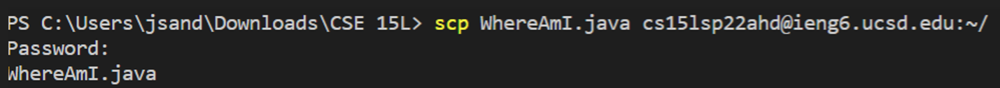
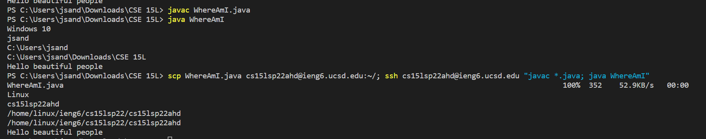

[Home](https://jassandhu14.github.io/cse15l-lab-reports/)
# Lab Report 1
## Installing VScode
Firstly, you want to install Visual Studio Code on your computer. You can do so with this [link](https://code.visualstudio.com). After following the instrucitons on the website, open up VScode. It should look like this.


You also want to install OpenSSH, which you can do by following this [link](https://docs.microsoft.com/en-us/windows-server/administration/openssh/openssh_install_firstuse).

## Remotely Connecting
For this step, you are going to need your account specific information which is different for each course. You can find your specific information [here](https://sdacs.ucsd.edu/~icc/index.php). 

Since I took CSE 15L during the Spring 2022 quarter, mine will be different from yours, however, you can still follow along. Your account should be similar to `cs15lsp22zzz` where the `z` characters are unique to your account.

To connect to the remote terminal, open the terminal on VScode and enter `ssh cs15lsp22zzz@ieng6.ucsd.edu`. You will be prompted with your password which you can enter. 

**NOTE**: when typing your password it will look like your inputs are not producing anything. However, this is a security feature to protect your information and you are actually typing your information. If you entered your information correctly, should see this message.


**Congratulations!!!** You can succesfully connected to a remote server.

## Trying Some Commands
Now that you're connected to the remote server, there are multiple useful commands you can use. Here are some helpful ones you can test. Try to figure out what they do.
* `cd ~`
* `cd `
* `ls -lat`
* `ls -a`
* `ls <directory>`
* `cp /home/linux/ieng6/cs15lsp22/public/hello.txt ~/`
* `cat /home/linux/ieng6/cs15lsp22/public/hello.txt`

Another important command is `Ctrl + D` which logs you out of the remote directory. Do not worry if you get an error running some commands. This is expected as seen in the below image.


## Moving Files with `scp`
Another important command is `scp` which allows you to transfer files between your computer and the remote server.

First create a file on your computer and name it whatever you want. Just make sure the file name is easy to type. In the file, make it print anything you want.

Run the file using `javac` and `java` to ensure it runs properly. To copy the file from your computer to the directory, type 

`scp <file name>.java cs15lsp22zzz@ieng6.ucsd.edu:~/ `. Type your password and the file should be copied to the remote directory. 



To test to see if it worked, type `ls` while in the remote directory and you should see your file listed. With the file being on the remote server, you can run it remotely. Try using `javac` and `java` to test it.

## Setting an SSH Key
Transferring files is kind of a hassle but we can make it easier by not having to type the password everytime. We can set up an ssh-keygen. Follow this line of code.

```
$ ssh-keygen
Generating public/private rsa key pair.
Enter file in which to save the key (/Users/<user-name>/.ssh/id_rsa): /Users/<user-name>/.ssh/id_rsa
Enter passphrase (empty for no passphrase):
Enter same passphrase again:
```
Make sure to leave the passphrase empty so you don't need a password everytime. You should see something like this.


If you're on Windows, you must also type `ssh-keygen -t ed25519`. For the next step, we have to copy the public key to the remote server. We can do this with the following steps.
```
$ ssh cs15lsp22zz@ieng6.ucsd.edu
<Enter Password>
# now on server
$ mkdir .ssh
$ <logout>
# back on client
$ scp /Users/<user-name>/.ssh/id_rsa.pub cs15lsp22zz@ieng6.ucsd.edu:~/.ssh/authorized_keys
```
After these steps, you should be able to connect to the remote server without having to type your password everytime.

## Optimizing Remote Running
We can make running files on a remote server even more pleasant. Here are some helpful tips to make running code easier.
* You can run code on the remote server without having to log in by adding quotations around the command. For example, `ssh cs15lsp22zz@ieng6.ucsd.edu "ls"`.
* You can add a semicolon after a command to run multiple commands. For example, `cp WhereAmI.java OtherMain.java; javac OtherMain.java; java WhereAmI`.
* You can use the up arrow key to recall the last command in the terminal.

With these tips you can edit your code, save it, transfer it to the remote server, and call it without having to log in to the server and in a few lines. 



After following all these steps, you should be able to log into the remote server and run many different commands on it. Enjoy!