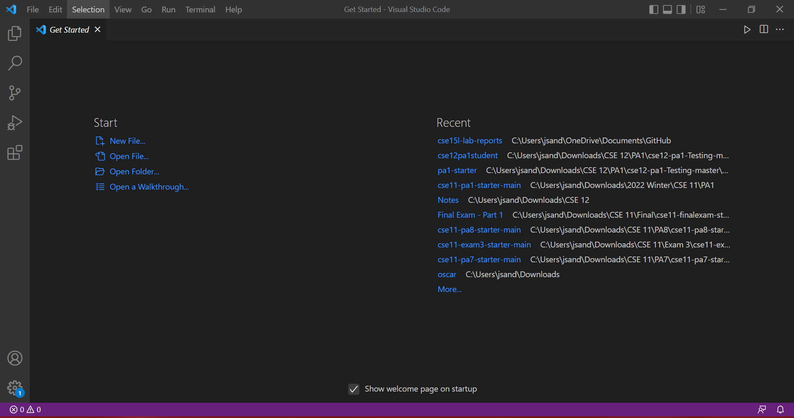
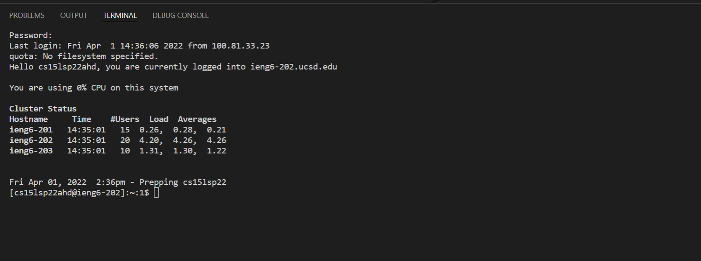
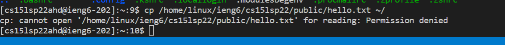

# Lab Report 1
## Installing VScode
Firstly, you want to install Visual Studio Code on your computer. You can do so with this [link](https://code.visualstudio.com). After following the instrucitons on the website, open up VScode. It should look like this.

You also want to install OpenSSH, which you can do by following this [link](https://docs.microsoft.com/en-us/windows-server/administration/openssh/openssh_install_firstuse).

## Remotely Connecting
For this step, you are going to need your account specific information which is different for each course. You can find your specific information [here](https://sdacs.ucsd.edu/~icc/index.php). 

Since I took CSE 15L during the Spring 2022 quarter, mine will be different from yours, however, you can still follow along. Your account should be similar to `cs15lsp22zzz` where the `z` characters are unique to your account.

To connect to the remote terminal, open the terminal on VScode and enter `ssh cs15lsp22zzz@ieng6.ucsd.edu`. You will be prompted with your password which you can enter. 

**NOTE**: when typing your password it will look like your inputs are not producing anything. However, this is a security feature to protect your information and you are actually typing your information. If you entered your information correctly, should see this message.

**Congratulations!!!** You can succesfully connected to a remote server.

## Trying Some Commands
Now that you're connected to the remote server, there are multiple useful commands you can use. Here are some helpful ones you can test. Try to figure out what they do.
* `cd ~`
* `cd `
* `ls -lat`
* `ls -a`
* `ls <directory>`
* `cp /home/linux/ieng6/cs15lsp22/public/hello.txt ~/`
* `cat /home/linux/ieng6/cs15lsp22/public/hello.txt`

Another important command is `Ctrl + D` which logs you out of the remote directory

Do not worry if you get an error running some commands. This is expected as seen in the below image.

## Moving Files with `scp`

## Setting an SSH Key

## Optimizing Remote Running