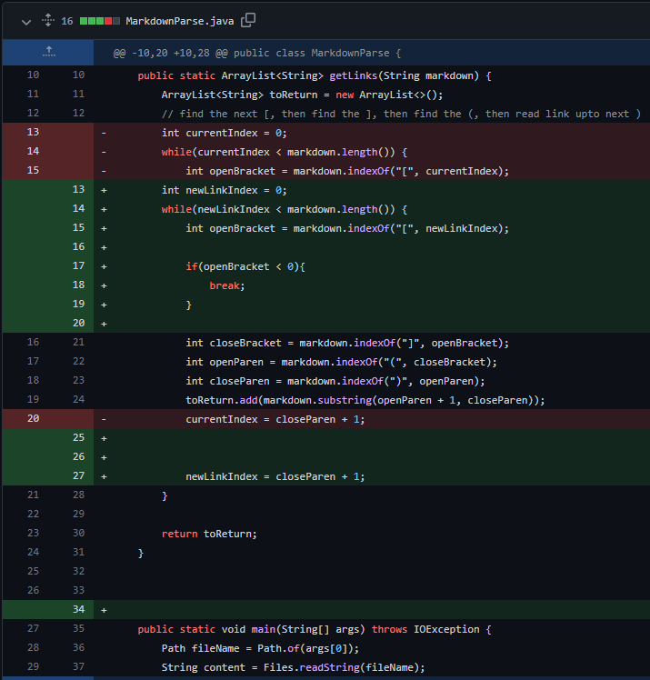
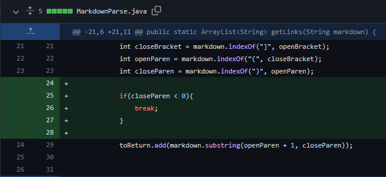
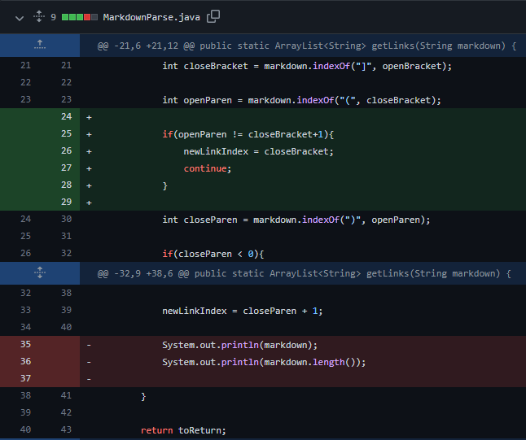

[Home](https://jassandhu14.github.io/cse15l-lab-reports/)
# Lab Report 2
## Error 1

[Failure Inducing Input](https://github.com/tcl002/markdown-parser/commit/48f02eaf1cf5fc65150101e1ff28fefd64e3ffb0)   (`new-markdown.md`)

Symptom: An infinite loop that prints the same value over and over again.

In the failure inducing input, the file ends with text that is not part of the link. This results in the getLinks method continuously search for another link in the file, which it never does, causing the infinite loop. 

## Error 2

[Failure Inducing Input](https://github.com/tcl002/markdown-parser/commit/505a0d42afb5a8b57cf2426e59f1b5c8d06e5c85)   (`test2.md`)

Symptom: An infinite loop that prints nothing over and over again.

In the failure inducing input, there is only an open parenthesis and not a close parenthesis, causing the code to continuously search for a close parenthesis. Since it cannot find a close parenthesis, the code infintely loops. 

## Error 3

[Failure Inducing Input](https://github.com/tcl002/markdown-parser/commit/b3d02ddfc84d1d79b0b62e51e77072d2b94f3478)   (`test3.md`)

Symptom: The code includes `789` in the list instead of the expected value of just `reallink`.

In the failure inducing input, the first brackets `[234]` are followed by `(789)` making the code think the link is `789`. It adds this value with the expected `reallink`, causing the error. The only way for the line to be considered a link is if it directly follows the brackets so we made that a factor.