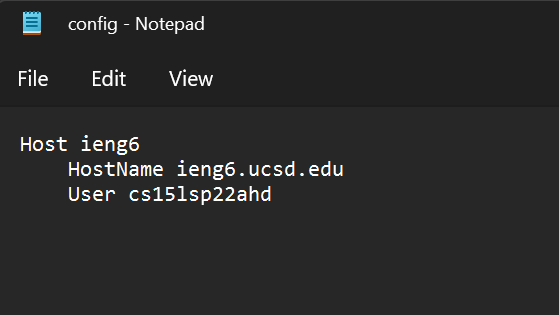
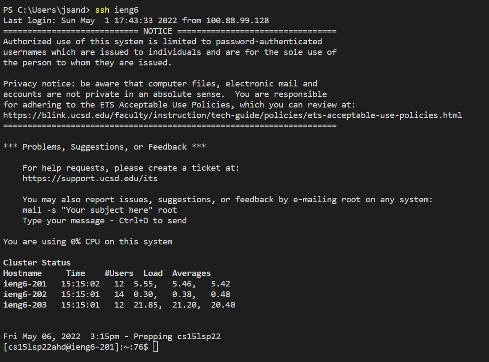
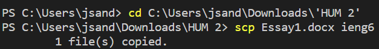
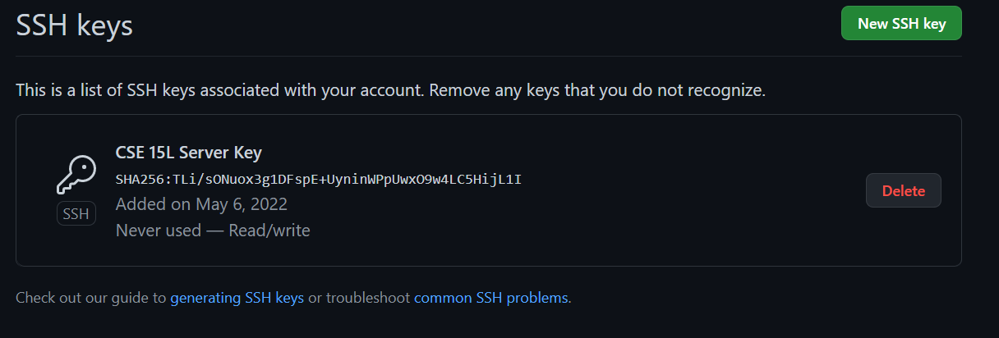
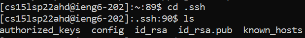
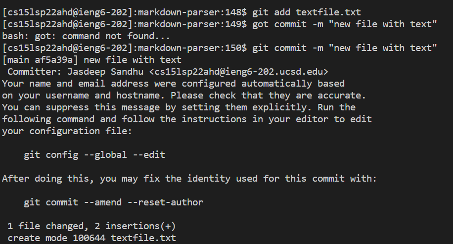
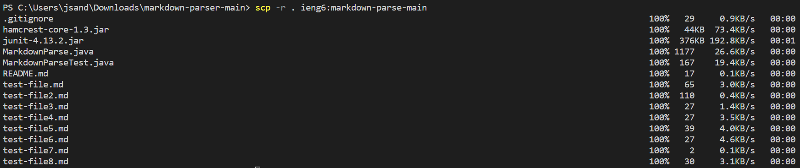
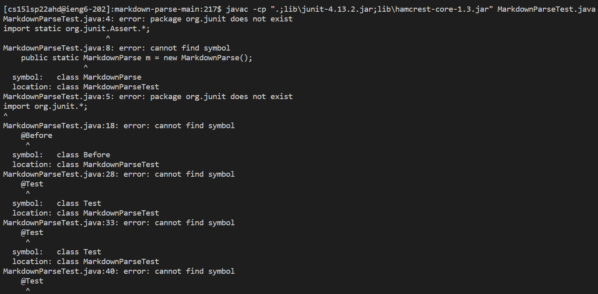
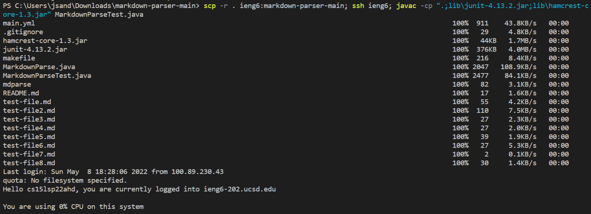

[Home](https://jassandhu14.github.io/cse15l-lab-reports/)

# Streamline ssh Configuration
## ssh Config File

## ssh command with host name

## scp file

   

# Set up GitHub access from ieng6
## Public Key

## Private Key

The private key is in id_rsa.
## git commands

## commit result
[Link to commit](https://github.com/dfigueroag/markdown-parser/commit/1f7c0409dcfc95175a3bf08c499f3ea07b981759) 
   

# Copy whole directories with `scp -r`
## Copying directory to ieng6

## Log in and compile

The version of markdown-parse I was using is not the updated version we worked on during lab. I only had access to the un-updated version provided by the professor. The same goes for the next step. That is why there are errors when compiling. However, `javac` still runs as expected.
## Combining steps
                                           