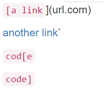
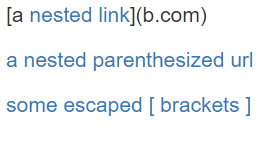
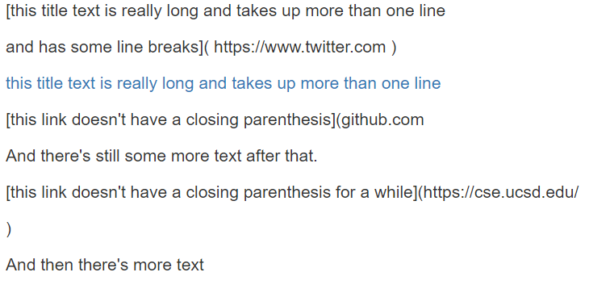
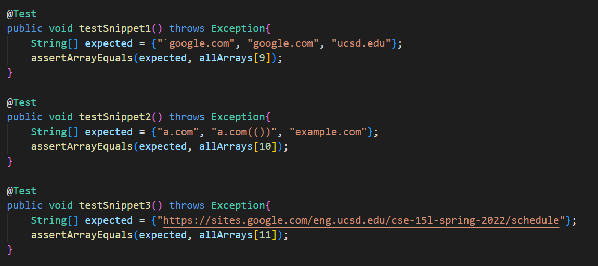
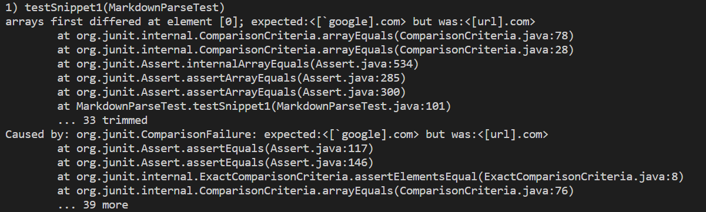
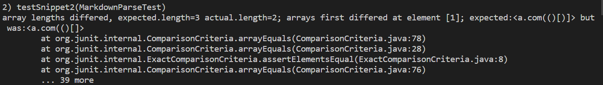
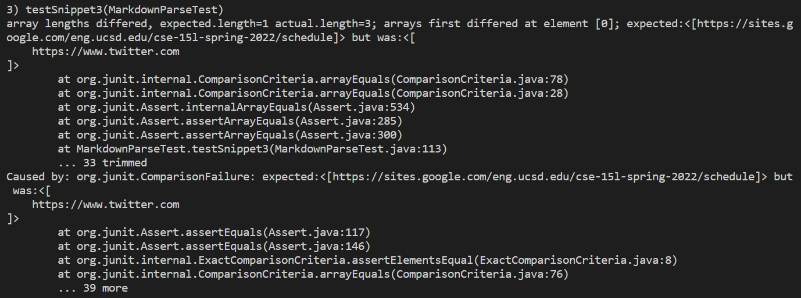
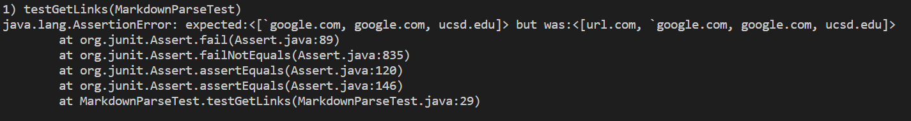
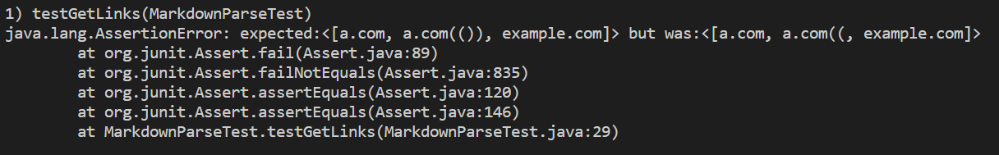
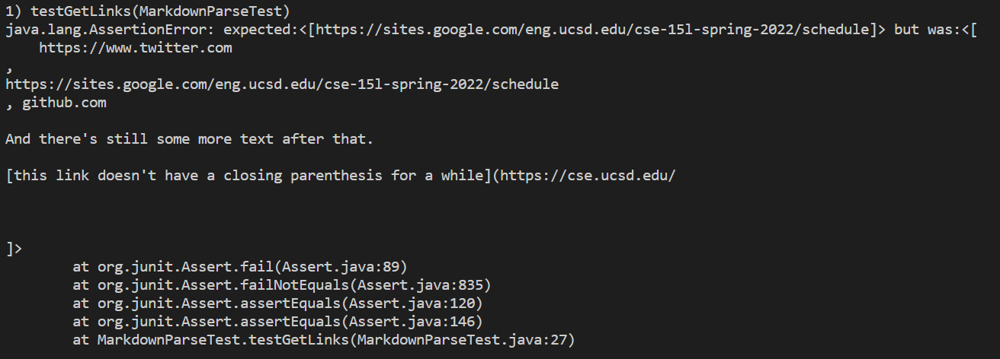

[Home](https://jassandhu14.github.io/cse15l-lab-reports/)

# Repositories
[My version of makrdown-parse](https://github.com/JasSandhu14/markdown-parser.git)

[Version that we reviewed](https://github.com/astoriama/markdown-parser.git)

# Expected Values
## Snippet 1

_This means that the links __`google.com__, __google.com__, and __ucsd.edu__ are expected._

## Snippet 2

_This means that the links __a.com__, __a.com(())__, and __example.com__ are expected._

## Snippet 3

_This means that __https://sites.google.com/eng.ucsd.edu/cse-15l-spring-2022/schedule__ is expected._

# Testing

Added the different snippet files as there own markdown files for the code to go through. The expected links I added individually as an array of strings according to the links we say prior.

## Our implementation
__Snippet 1__

__Snippet 2__

__Snippet 3__

## Their implementation
__Snippet 1__

__Snippet 2__

__Snippet 3__
