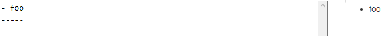
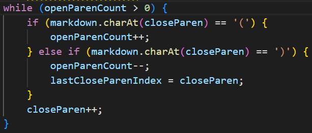
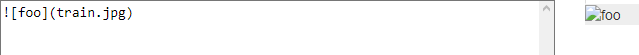
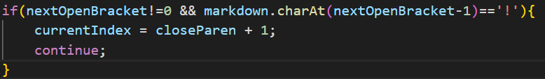

[Home](https://jassandhu14.github.io/cse15l-lab-reports/)
# Lab Report 5
## Finding Tests
To compare my implementation of `markdownParse` and the provided implementation, I copied the folder that had all the tests into my directory. Similarly, I coped `script.sh` as well in order to run `time bash script.sh`. By running this in my implementation and the given implementation, I can compare the two to see how they differ.

Note: My version of `markdownParse` was created in conjunction with my lab group, notably Tyler and Diego.

## [Test 99](https://github.com/tcl002/cse15l-lab-reports/blob/main/99.md)
Our implementation proved to be false whereas the provided code provided the correct input.
### My Code

### Given Code

### Expected

### Errors
Our version of the code returns an index out of bounds exception, clearly making it wrong. It is expected to return an empty array as seen in the expected.

The issue most likely lies with the variables `closeParen` and `openParenCount`. I believe that `closeParen` reaches the end of the file length before `openParenCount` reaches 0 to end the while loop. 

## [Test 577](https://github.com/tcl002/cse15l-lab-reports/blob/main/577.md)
For this test, our code returns the expected input while I believe the given code is false. 
### My Code

### Given Code

### Expected

### Errors
The issue with the given code is that it never checks if there is an exclamation mark prior to the open bracket. We included this in our code in case there is an image instead of a link since their formatting is similar.

This is how we tested to see if there was an exclamation in our implementation.